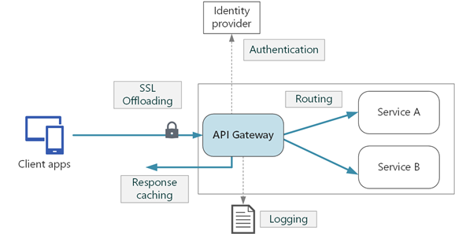

# AKS Terraform Setup

An attempt at fast flow gitops style platform software development.

Generally following the [MS AKS Baseline](https://github.com/mspnp/aks-baseline) and more complete example [here](https://github.com/Azure-Samples/private-aks-cluster-terraform-devops) with a Terraform infrastructure install and Helm chart configuration.

## Features

|                                         | Prod | Dev
|-----------------------------------------|------|-
| Egress restriction using Azure Firewall | x    |
| Ingress Controller                      |
| Azure Active Directory Pod Identity     |
| Resource Limits                         |
| Other Infrastructure aspects            |
| Zero Trust Network Policies             |
| Horizontal Pod Autoscaling              |
| Cluster Autoscaling                     |
| Readiness/Liveness Probes               |
| Helm charts                             |
| Distributed Monitoring                  |

## Customizations

|                          | Complete
|--------------------------|-------
| Terraform                |
| ArgoCD                   |
| Istio Ingress Controller |
| Cert-Manager             |
| Sealed Secrets           |
| Prometheus               |

## Other TODO

|                               | Complete
|-------------------------------|-------
| Canary Deploy                 |
| Git Actions Application Build |
| Test integration (API, E2E)   |
| Local Development Setup       |




## Prerequisites

- Terraform
- kubectl
- Helm

## Steps

- [x] Create backend `./bootstrap.ps1`
- [x] Fill variables
  - Determine aks supported version `az aks get-versions -l westus2`
  - Create public key for ssh
  - Determine aks VM size, disc type see default and addtional node vars
- [x] Deploy platform `./apply.ps1`
  - apply takes about 30m
  - If AKS cluster creation times out and errors check in portal and determine if it was create successfully. See [issue](https://github.com/Azure/AKS/issues/1972).
    Yes? From environment (dev, pord) path `terraform import module.aks_cluster.azurerm_kubernetes_cluster.aks_cluster /subscriptions/[subscription id]/resourcegroups/[Resource Group Name]/providers/Microsoft.ContainerService/managedClusters/[Aks Cluster name]`
    No? destroy and try again
- [x] Tear down platform `./destroy.ps1`
  - destroy takes about 18m
  - If the destroy does not run cleanly it will likely orphan diagnostic settings. The next apply will fail, see [issue](https://github.com/hashicorp/terraform-provider-azurerm/issues/6389). After running apply which will finish with errors indicating the resource(s) with problems. Go into the Portal Subsription -> Resources -> [Resource with Issue] -> Diagnostic Settings -> Delete setting. Then re-apply or Destroy and re-apply.
- [ ] Verify setup
  - [x] Bastion -> VM connection [VM Verification](#vm-verification)
  - [x] [AKS setup](#dev)
  - [ ] [Argo CD Setup](#argo-cd-setup)
  - [ ] Ingress via MS App Gateway
        <https://ls-lrt.com/creating-a-aks-private-cluster-with-application-gateway-and-istio>
  - [ ] TLS setup

## DEV

Dev is a less secure cheaper version of Prod. Applying `main.tf` will add you as cluster admin for full `kubectl` access. Resources are created in the defalt namespace.

- `az aks get-credentials --resource-group dev-aks-platform-rg --name PlatformAks`
- `kubectl get nodes`

## Argo CD Setup

1. Install Argo CD - from charts repo > `helm install argo-cd argo-cd/` [source](https://www.arthurkoziel.com/setting-up-argocd-with-helm/)
    - <https://www.buchatech.com/2021/11/get-started-with-argo-cd-azure-kubernetes-service/>
    - <https://nemo83.dev/posts/argocd-istio-operator-bootstrap/>
    - <https://argo-cd.readthedocs.io/en/stable/operator-manual/cluster-bootstrapping/>

    - Get admin password

        ```powershell
        $pwd = kubectl -n default get secret argocd-initial-admin-secret -o jsonpath="{.data.password}"
        [System.Text.Encoding]::UTF8.GetString([System.Convert]::FromBase64String($pwd))
        ```

    - Port forward `kubectl port-forward svc/argo-cd-argocd-server 8080:443`

### SSO Setup

1. Setup SSO vaguely following [this](https://medium.com/dzerolabs/configuring-sso-with-azure-active-directory-on-argocd-d20be4ba753b)
    - <https://argo-cd.readthedocs.io/en/stable/operator-manual/user-management/microsoft/#azure-ad-app-registration-auth-using-oidc>

    - Need a server name
1. Post setup grant admin consent in Azure Application API permissions.
1. `kubectl edit configmap argocd-cm -n argocd`

## Networking Setup

Links to help with subnet CIDR block setup. I found creating the VNet then manually adding subnets in the azure portal, recording the blocks, deleting, and then apply them via terraform to be the easiest.

- [Api Gateway WAF Config](https://docs.microsoft.com/en-us/azure/application-gateway/configuration-infrastructure)
- [Subnet Calculator](https://subnetcalculator.info/SubnetCalculator) calculate subnet blocks with N desired IPs + 2 reserved
- [CIDR block ranges](https://www.ionos.com/digitalguide/server/know-how/cidr-classless-inter-domain-routing/)

## VM Bootstrap scripting

`./modules/virtual_machine/scripts/configure-jumpbox-vm.sh` contains a linux jumpbox bootstrap script for the linux VMs that runs on creation. Installs tooling for initial K8s setup and use.

- [VM bootstrap explainer](https://gmusumeci.medium.com/how-to-bootstrapping-azure-vms-with-terraform-c8fdaa457836)
- [GitHub Source](https://github.com/guillermo-musumeci/terraform-azure-vm-bootstrapping)

### VM Verification

In the Azure Portal [connect to VM via Bastion](https://docs.microsoft.com/en-us/azure/bastion/bastion-connect-vm-ssh-linux) using the private key that was created in step 2 Fill variables above.

## Cleanup

Run `terraform destroy` then `az group delete --name infra-state-rg --yes` for complete cleanup

## References

- [Primary resource for Terraform Setup](https://github.com/Azure-Samples/private-aks-cluster-terraform-devops)
- [Primary resource docs](https://docs.microsoft.com/en-us/azure/architecture/example-scenario/aks-firewall/aks-firewall)
- [MS AKS Baseline](https://github.com/mspnp/aks-baseline)
- [More detailed Baseline setup](https://github.com/mspnp/aks-fabrikam-dronedelivery)
- [I Terraform Setup](https://github.com/mofaizal/rampup-project)
- [II Terraform Setup](https://github.com/pliniogsnascimento/aks-gitops-lab)
- [III Terraform Setup](https://github.com/J0hn-B/eshop-aks)
- [IV Terraform Setup (*)](https://github.com/mathieu-benoit/myakscluster)
- [Hashicorp's Setup](https://github.com/hashicorp/learn-terraform-provision-aks-cluster)
- [GitHub Action AKS deploy](https://docs.microsoft.com/en-us/azure/aks/kubernetes-action)
- [Terraform AD provider docs](https://registry.terraform.io/providers/hashicorp/azuread/latest/docs)
- [AKS for microservices](https://docs.microsoft.com/en-us/azure/architecture/reference-architectures/containers/aks-microservices/aks-microservices-advanced)
- [Terraform Examples](https://github.com/hashicorp/terraform-provider-azurerm/tree/main/examples/kubernetes)
- [ArgoCD readme](https://github.com/argoproj/argo-cd)
